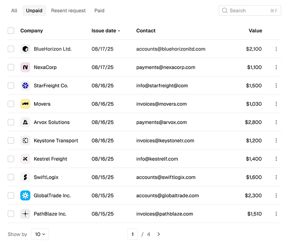

# Power BI - Paginação em Tabelas

Este projeto demonstra como implementar **paginação dinâmica** em tabelas no Power BI, permitindo controlar a quantidade de linhas exibidas (ex: 10, 20, 50, 100) e navegar entre páginas (1/2/3...), semelhante ao comportamento de sistemas web.

---

## 🎯 Objetivo
* Criar uma tabela com paginação customizada no Power BI.  
* Simular botões de **"Mostrar x Linhas"** e **navegação por páginas**.  
* Garantir que a quantidade de páginas se ajuste dinamicamente conforme a quantidade de registros.  
* Integrar a paginação com filtros adicionais como *Paid*, *Unpaid* e *Recent Request*.  


## 📂 Estrutura do projeto
```
powerbi-pagination
│
├── README.md # Explicação geral do projeto
├── docs/
│ ├── imagens/ # Prints do dashboard e filtros
│ └── explicacao.md # Documentação detalhada (DAX/M)
├── dax/
│ ├── IndiceDinamico.dax
│ ├── TotalPaginas.dax
│ ├── PageStart.dax
│ ├── PageEnd.dax
│ └── TabelaFiltrada.dax
└── powerquery/
└── Calendar.m # Código M ou scripts auxiliares
```

## 📑 Documentação detalhada

A explicação completa das medidas e lógica está em [`docs/explicacao.md`](docs/explicacao.md).

## ⚙️ Como usar

1. Clone este repositório:

   ```bash
   git clone [https://github.com/jaquelinejustino/powerbi-pagination.git]
   ```

2. Importe as medidas DAX da pasta `dax/` para seu modelo Power BI

3. Importe os scripts M da pasta `powerquery/`

4. Configure os slicers para **ShowBy** e **Paginação**

5. Teste aplicando filtros e navegando pelas páginas

## 📊 Exemplo


No exemplo acima:

O usuário escolheu: Show 10 (10 linhas por página).

Página atual: 1/4.

A tabela mostra os registros correspondentes à página 1, respeitando os filtros ativos (Paid, Unpaid, etc.).

## 📌 Observações

* Esse exemplo foi construído em Power BI Desktop versão mais recente.
* A lógica pode ser adaptada para outros cenários como outros tipos de visualizações.
* Funcionalidade de paginação é apenas simulada, já que Power BI não possui nativamente esse recurso.

## 📄 Licença

Este projeto é de uso livre para fins de estudo e pode ser adaptado conforme necessidade.
